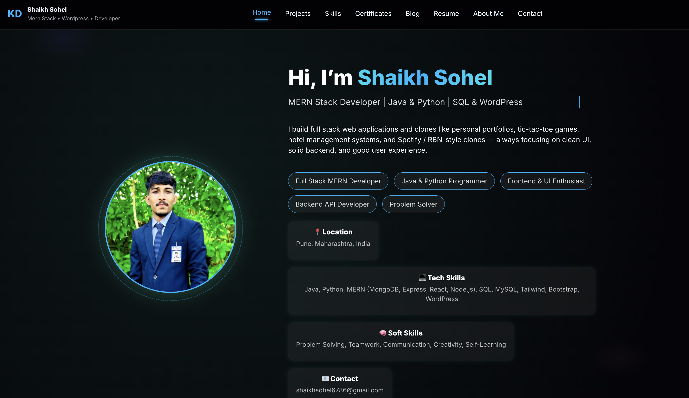
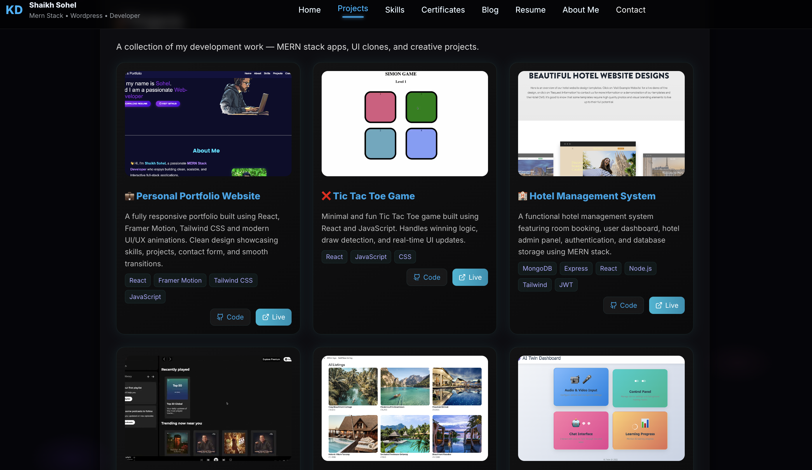

# 💻 Shaikh Sohel — Personal Portfolio Website

Welcome to my personal **developer portfolio website**, built using **React.js** and **Vite**.  
This portfolio showcases my projects, skills, experience, and journey as a **Full Stack (MERN) Developer** with an interest in **AI, ML, and modern Web Technologies**.

---

## 🌐 Live Website
🚀 (Will be updated after deployment on Vercel)

---

## 🖼️ Screenshots

### Home Page


### Projects Section


### Contact Section


> 📌 Make sure these images exist inside the `screenshots/` folder.

---

## 🚀 Features

- 🎨 Modern and clean UI design
- ⚡ Built with **React + Vite** for fast performance
- 💼 Sections for About, Skills, Projects, Resume, and Contact
- 🧠 Showcases Full Stack & AI-related projects
- 📱 Fully responsive (Mobile, Tablet, Desktop)
- 📨 Contact form integration
- 🌙 Dark-themed developer-friendly layout

---

## 🛠️ Tech Stack

| Category | Tools |
|--------|-------|
| Frontend | React.js, JavaScript (ES6+), HTML5, CSS3 |
| Build Tool | Vite |
| Styling | CSS / Tailwind CSS |
| Version Control | Git & GitHub |
| Deployment | Vercel |

---

## ⚙️ Setup Instructions (Run Locally)

Follow these steps to run the project on your local machine:

```bash
# Clone the repository
git clone https://github.com/S-SOHEL/shaikh-sohel-portfolio.git

# Go to the project folder
cd shaikh-sohel-portfolio

# Install dependencies
npm install

# Start the development server
npm run dev
